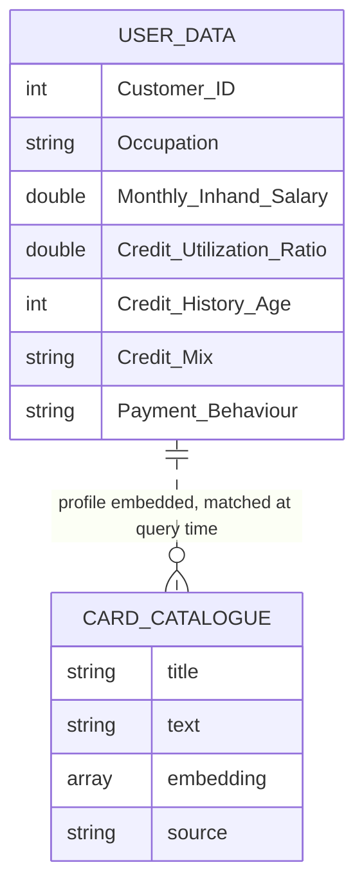

# EDD — Entity Document Diagram

MongoDB data model for the GenAI Credit Scoring demo.

Database and collection names come from `MONGODB_DB` and `MONGODB_COLLECTION`. Only
the card catalogue collection is configurable; the applicant collection is always
called `user_data`.

Field types below were sampled from a live seeded database. This application defines
no JSON Schema validators, so nothing enforces these shapes.

---

## Entity overview

| Collection | Configurable | Source file | Read by | Vector index |
| --- | --- | --- | --- | --- |
| `user_data` | no | `data/user_data.json` | Both endpoints, and the UI sidebar | — |
| card catalogue | yes, via `MONGODB_COLLECTION` | `data/cc_products_voyage.json` | `POST /product_suggestions` | `default` |

Files in `data/` that are **not** loaded by the running demo: `cc_products.json` (the
same catalogue without embeddings), `credit_history.json` (56 MB, model training),
and `train_data.json` (95 MB, model training).

---

## `user_data`

One document per applicant per month. The demo reads a single applicant, hardcoded to
`Customer_ID` 8625 in the frontend. Written by `POST /user_data/update_one` when the
UI saves a modified profile.

| Field | Type | Notes |
| --- | --- | --- |
| `_id` | ObjectId | |
| `ID` | int | Row identifier from the source dataset |
| `Customer_ID` | int | Applicant key used by every lookup |
| `Month` | int | 1–12 |
| `Name` | string | Often truncated in the source data, e.g. `"Np"` |
| `Age` | int | |
| `SSN` | int | Synthetic |
| `Occupation` | string | e.g. `"Lawyer"`, `"Teacher"` |
| `Annual_Income` | double | |
| `Monthly_Inhand_Salary` | double | Drives the credit limit calculation |
| `Num_Bank_Accounts` | int | |
| `Num_Credit_Card` | int | |
| `Interest_Rate` | int | Percent |
| `Num_of_Loan` | int | |
| `Type_of_Loan` | string | Comma-separated list, or `"No Data"` |
| `Delay_from_due_date` | int | Days |
| `Num_of_Delayed_Payment` | int | Feeds the Repayment History score |
| `Changed_Credit_Limit` | double | Percent change |
| `Num_Credit_Inquiries` | int | Feeds the Num Credit Inquiries score |
| `Credit_Mix` | string | `Good` \| `Standard` \| `Bad` |
| `Outstanding_Debt` | double | Feeds the Outstanding score |
| `Credit_Utilization_Ratio` | double | Percent, not a fraction — the scorecard divides by 100 |
| `Credit_History_Age` | int | **Months**, despite the name; ~390 is over 30 years |
| `Payment_of_Min_Amount` | string | `Yes` \| `No` \| `NM` |
| `Total_EMI_per_month` | int | |
| `Amount_invested_monthly` | double | |
| `Payment_Behaviour` | string | e.g. `"High_spent_Large_value_payments"` |
| `Monthly_Balance` | double | |
| `Credit_Score` | string | Label from the source dataset, **not** the model's output |
| `Monthly_Rental_Commitment` | double | Shown as "Monthly Rentals" in the UI |

Indexes: `_id_` only. Every applicant lookup is an unindexed scan on `Customer_ID`;
fine at 12,500 documents, worth an index beyond that.

## Card catalogue (`MONGODB_COLLECTION`)

Chunked credit card product descriptions with embeddings. Read-only at runtime.

| Field | Type | Notes |
| --- | --- | --- |
| `_id` | ObjectId | |
| `title` | string | e.g. `"The Elite Voyager Gold Credit Card"` |
| `text` | string | The chunk that was embedded — eligibility, fees, benefits |
| `embedding` | array\<double\> | 1024 dimensions, `voyage-3-large` |
| `source` | string | Origin URL of the product page |

Vector search index `default`:

```json
{
  "fields": [
    {
      "type": "vector",
      "path": "embedding",
      "numDimensions": 1024,
      "similarity": "euclidean"
    }
  ]
}
```

The index **must** be type `vectorSearch`. langchain-mongodb queries with the
`$vectorSearch` aggregation stage, which does not read the older `knnVector` search
index format.

---

## Relationships

There are no foreign keys and no references between the two collections. They are
joined only at request time, inside `POST /product_suggestions`: the applicant's
profile is turned into a search phrase, embedded, and matched against the card
embeddings.



The model output is never persisted. Predictions, credit limits, scorecard values, and
LLM explanations are computed per request and cached in memory only — `invoke_llm` and
`get_card_suggestions` are wrapped in `lru_cache`, so a restart clears them.

---

## Known inconsistencies

1. **`Credit_History_Age` is in months, not years.** The name suggests years, and the
   prompt that describes this field to the LLM says only "the age of credit history of
   the human" without giving a unit, so the model has to infer it. A stored value of
   390 is about 32 years. Anything treating this field as years is wrong by a factor
   of twelve.

2. **`Credit_Score` in `user_data` is not the model's prediction.** It is a label from
   the source training data. The value the UI shows comes from the XGBoost model at
   request time and may disagree with the stored field.

3. **`Credit_Utilization_Ratio` is a percentage while the scorecard expects a
   fraction.** `stat_score_util` divides by 100 at the call site rather than at
   storage, so any new consumer has to remember the unit.

4. **The seed files are Extended JSON.** `_id` values are `{"$oid": …}`. Import with
   `mongoimport` or `bson.json_util.loads`; a plain `json.load` followed by
   `insert_many` stores `_id` as a nested object instead of an ObjectId.

Update this section when any of these are fixed, otherwise it becomes misleading.
