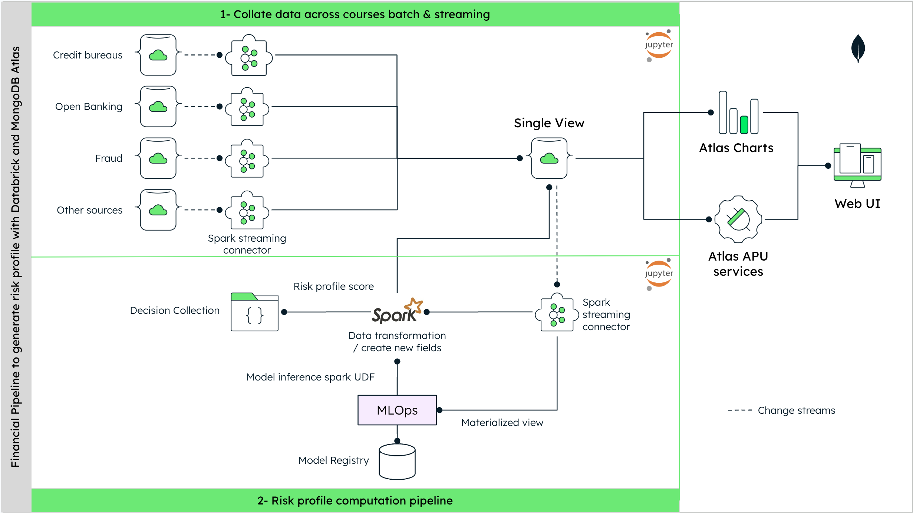

# GenAI Credit Scoring Demo

Credit scoring has always faced persistent challenges, from biases and discrimination to limitations in adapting to evolving economic landscapes. The challenges of traditional models are being overcome through the adoption of alternative credit scoring methods by offering a more inclusive and nuanced assessment of creditworthiness. This prompted a paradigm shift towards leveraging artificial intelligence (AI) and alternative data to reshape the foundations of credit scoring. In this solution, we are using a machine learning algorithm to create a customer/user banking profile by combining relevant data points. Below you can see the architectural diagram of the data processing pipeline for the predicting probability of delinquency and credit scoring.



> [!Note]
> The notebooks present in this image are the ones coming from [this repo](https://github.com/ashwin-gangadhar-mdb/mdb-bfsi-genai/tree/main/notebooks). You do not need them to proceed with the demo's installation.

If you want to delve into more detail, our blog sheds light on credit scoring fundamentals, challenges with traditional systems, and the role of AI in creating more inclusive models.

[Read the Blog!](https://www.mongodb.com/blog/post/credit-scoring-applications-with-generative-ai)

This GitHub repository presents a demo in which you will be able to log on to a client that has already submitted a Credit card application. This approach can be applied to other credit products – like personal loans, mortgages, corporate loans, and trade finance credit lines – and their applications without necessarily confining them to a credit card product only. Its main functionality is for the customer to use generative AI (GenAI) to get a detailed explanation of why the application was rejected. We will also leverage MongoDB vector search capabilities to provide recommendations of different cards that might be more adapted for the customer.

> [!Warning]
> This demo uses LLMs. We will be using Fireworks.ai and therefore will need an API key, which is not included here. However, you can still sign up for free with your Google account [here](https://fireworks.ai/login). Fireworks.ai is a partner of MongoDB AI Applications Program (MAAP), which you can read more about [here](https://www.mongodb.com/services/consulting/ai-applications-program). You can also choose to use Google Gemini by [switching to the "main" branch](https://github.com/mongodb-industry-solutions/Credit_score/tree/main).

## Installation of the Demo

The installation is divided into five:

- [Provisioning an M0 Atlas instance](https://www.mongodb.com/docs/atlas/tutorial/deploy-free-tier-cluster/)
- [Insert the two file in ./data folder with mongoDB compass on a database called "bfsi-genai"](https://www.mongodb.com/docs/compass/current/documents/insert/)
- Create your own [search index](https://www.mongodb.com/docs/atlas/atlas-search/create-index/) called "default" on the cc_products collection.

```json
{
  "mappings": {
    "dynamic": true,
    "fields": {
      "embedding": [
        {
          "dimensions": 768,
          "similarity": "euclidean",
          "type": "knnVector"
        }
      ]
    }
  }
}
```

- [Installation of the backend](./backend/)
- [Installation of the frontend](./frontend/)

### Build the backend and frontend with Docker (faster)

To build the Docker images and start the services, run the following command:

```
make build
```

### Stopping the Application

To stop all running services, use the command:

```
make stop
```

### Cleaning Up

To remove all images and containers associated with the application, execute:

```
make clean
```

## Summary

This demonstration serves as an interesting example for how the adoption of alternative credit scoring methods, leveraging artificial intelligence, can reshape traditional credit scoring experience.

In the previous sections, we explored how to:

- To insert your own dataset
- Set up your collection for vector search.

Are you prepared to harness these capabilities for your projects? Should you encounter any roadblocks or have questions, our vibrant [developer forums](https://www.mongodb.com/community/forums/) are here to support you every step of the way. Or if you prefer to contact us directly at [industry.solutions@mongodb.com](mailto:industry.solutions@mongodb.com).

You can also dive into the following resources:

- [Reducing Bias in Credit Scoring with Generative Al](https://www.mongodb.com/blog/post/credit-scoring-applications-with-generative-ai)

## Disclaimer

This product is not a MongoDB official product. Use at your own risk!

## Authors

- Ashwin Gangadhar, Solutions Architect, Partner Solutions, MongoDB
- Wei You Pan, Global Director, Financial Industry Solutions, MongoDB
- Paul Claret, Senior Specialist, Industry Solutions, MongoDB

Feel free to refer to [the original repo](https://github.com/ashwin-gangadhar-mdb/mdb-bfsi-genai/tree/main/) for more content like this one.
