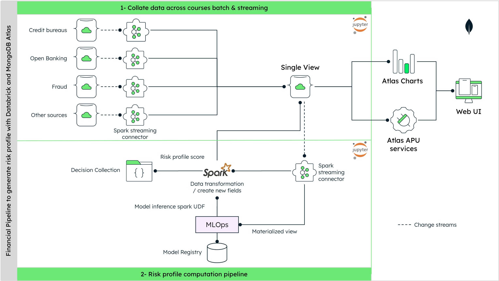

# GenAI Credit Scoring Demo

Credit scoring, has always faced persistent challenges, from biases and discrimination to limitations in adapting to evolving economic landscapes. The conventional reliance on historical credit data, often leading to biased outcomes. This prompted a paradigm shift towards leveraging artificial intelligence (AI). In this repo we are using a we use a Machine learning allgorithm to create a customer/user banking profile by combining relevant data points. Bellow you can see the architectural diagram of the data processing pipeline for the predicting probability of delinquency and credit scoring.

> [!Note]
> The notebooks present on this image are the ones coming from [this repo](https://github.com/ashwin-gangadhar-mdb/mdb-bfsi-genai/tree/main/notebooks). You do not need them to proceed with the demo's installation.

If you want to delve into more detail, our blog sheds light on credit scoring fundamentals, challenges with traditional systems, and the role of AI in creating more inclusive models. 

[Read the Blog!](https://www.mongodb.com/blog/post/credit-scoring-applications-with-generative-ai)

This GitHub repository presents a demo in which you will be able to log on to a client that has already submitted a Credit card application. It's main functionality is to be able for the customer to use generative AI (GenAI) to get an detailed explanation on why the application was rejected. We will also leveradge MongoDB vector search capabilities to provide a set of different cards that might be more addapted for the customer.

> [!Warning]
> This demo uses LLMs, we will be using Google Gemini and therefore will need an API Key, which is not included in here. You can also decide to change to an OpenAI model but will require some light code changes and an OpenAI API Key.

## Installation of the Demo

The installation is divited into 4:
- [Provisioning an M0 Atlas instance](https://www.mongodb.com/docs/atlas/tutorial/deploy-free-tier-cluster/)
- [Insert the two file in ./data folder with mongoDB compass on a database called "bfsi-genai"](https://www.mongodb.com/docs/compass/current/documents/insert/)
- [Installation of the backend](./backend/)
- [Installation of the frontend](./frontend/)

## Summary

This demonstration serves as an interesting example for clearing transactions using innovative technologies such as OpenAI embeddings and MongoDB search capabilities.

In the previous sections, we explored how to:
- Create your own dataset
- Set up your own microservice with MongoDB's app services
- Set up your collection for both full-text and vector search.

Are you prepared to harness these capabilities for your projects? Should you encounter any roadblocks or have questions, our vibrant [developer forums](https://www.mongodb.com/community/forums/) are here to support you every step of the way. Or if you prefer to contact us directly at [industry.solutions@mongodb.com](mailto:industry.solutions@mongodb.com).

## Disclaimer

This product is not a MongoDB official product. Use at your own risk!

## Authors

- Ashwin Gangadhar, Solutions Architect, Partner Solutions, MongoDB
- Paul Claret, Senior Specialist, Industry Solutions, MongoDB

Feel free to refer to [the original repo](https://github.com/ashwin-gangadhar-mdb/mdb-bfsi-genai/tree/main/) for more content like this one.
