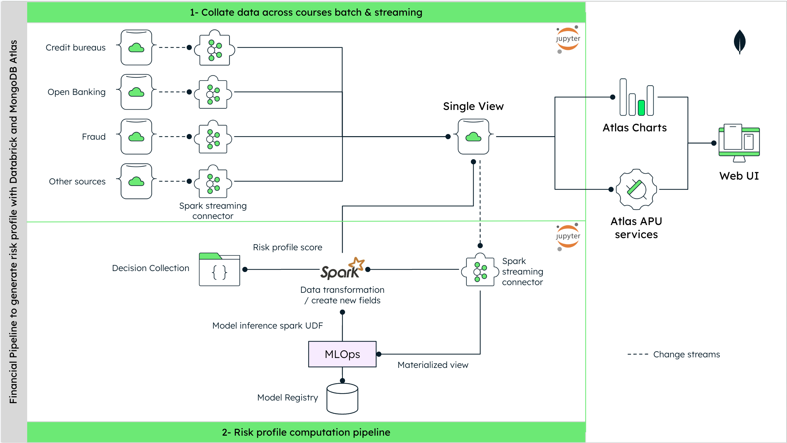

# GenAI Credit Scoring Demo

Credit scoring has always faced persistent challenges, from biases and discrimination to limitations in adapting to evolving economic landscapes. The challenges of traditional models are being overcome through the adoption of alternative credit scoring methods by offering a more inclusive and nuanced assessment of creditworthiness. This prompted a paradigm shift towards leveraging artificial intelligence (AI) and alternative data to reshape the foundations of credit scoring. In this solution, we are using a machine learning algorithm to create a customer/user banking profile by combining relevant data points. Below you can see the architectural diagram of the data processing pipeline for the predicting probability of delinquency and credit scoring.



> [!Note]
> The notebooks present in this image are the ones coming from [this repo](https://github.com/ashwin-gangadhar-mdb/mdb-bfsi-genai/tree/main/notebooks). You do not need them to proceed with the demo's installation.

If you want to delve into more detail, our blog sheds light on credit scoring fundamentals, challenges with traditional systems, and the role of AI in creating more inclusive models.

[Read the Blog!](https://www.mongodb.com/blog/post/credit-scoring-applications-with-generative-ai?utm_campaign=devrel&utm_medium=github&utm_content=genai.credit.score&utm_term=learning.fuel)

This GitHub repository presents a demo in which you will be able to log on to a client that has already submitted a Credit card application. This approach can be applied to other credit products – like personal loans, mortgages, corporate loans, and trade finance credit lines – and their applications without necessarily confining them to a credit card product only. Its main functionality is for the customer to use generative AI (GenAI) to get a detailed explanation of why the application was rejected. We will also leverage MongoDB vector search capabilities to provide recommendations of different cards that might be more adapted for the customer.

> [!Warning]
> This demo uses LLMs. We will be using Fireworks.ai and therefore will need an API key, which is not included here. However, you can still sign up for free with your Google account [here](https://fireworks.ai/login). Fireworks.ai is a partner of MongoDB AI Applications Program (MAAP), which you can read more about [here](https://www.mongodb.com/services/consulting/ai-applications-program?utm_campaign=devrel&utm_medium=github&utm_content=genai.credit.score&utm_term=learning.fuel).

## Why MongoDB?

Alternative credit scoring means combining data that does not share a shape. This
demo needs all of it behind one connection string:

- **One store for the scoring inputs and the card catalogue.** A banking profile is
  flat, numeric, and wide — 30 fields per applicant. A credit card product is prose:
  eligibility rules, fee waivers, lounge access. Both live in the same database, read
  by the same client, with no join between two systems.
- **Vector search on the same data you already store.** Finding cards that suit an
  applicant is a similarity problem, not a filter. The card descriptions and their
  embeddings sit in one collection, so retrieval is a query rather than a round trip
  to a separate vector database that has to be kept in sync.
- **A document model that survives model changes.** The scorecard's inputs shift as
  the model is retrained. Adding a field like `Monthly_Rental_Commitment` needs no
  migration and no schema change.

## Why Voyage AI?

The card catalogue is marketing copy, and the query is a machine-generated profile
of an applicant. These read nothing alike, which is the whole retrieval problem:

- **Matching intent, not vocabulary.** A "Good" applicant should surface premium
  cards, but the profile never contains the words *priority pass*, *lounge*, or
  *super premium* — those appear only in the card text. The embedding has to connect
  a salary and a utilization ratio to the language of a product page.
- **Keeping close products apart.** Many of these cards differ only in fee waivers
  and reward tiers, and several share a name stem. Retrieval is only useful if a
  premium travel card and an entry-level cashback card land in different places.
- **1024 dimensions, from the same platform as the database.** `voyage-3-large`
  matches the index this repo creates, and one API key covers embedding the query
  and searching it — no second vendor to provision.

## Installation of the Demo

### Prerequisites

- **Python 3.13** (the backend pins `>=3.13,<3.14`; the Docker image uses 3.13-slim)
- **Node.js 20+** (the frontend Docker image pins 20.10.0)
- **A MongoDB Atlas cluster** — Atlas is required, because the demo
  uses MongoDB Vector Search. [Sign up for free](https://www.mongodb.com/products/platform?utm_campaign=devrel&utm_medium=github&utm_content=genai.credit.score&utm_term=learning.fuel)
  and create an M0 cluster
- **A Fireworks AI API key** — [sign up free](https://fireworks.ai/login)
- **A Voyage AI API key** — [get one here](https://www.voyageai.com/). It must be a
  key issued by Voyage AI directly
- **Docker 24+** — only if you use the Docker path below
- **macOS only:** `brew install libomp`, which XGBoost needs in order to load

The installation is divided into five:

- [Provisioning an M0 Atlas instance](https://www.mongodb.com/docs/atlas/tutorial/deploy-free-tier-cluster/?utm_campaign=devrel&utm_medium=github&utm_content=genai.credit.score&utm_term=learning.fuel)
- [Import two files from ./data with MongoDB Compass](https://www.mongodb.com/docs/compass/current/documents/insert/?utm_campaign=devrel&utm_medium=github&utm_content=genai.credit.score&utm_term=learning.fuel) into a database of your choice:
  - `user_data.json` into a collection named `user_data`
  - `cc_products_voyage.json` into a collection of your choice — this is the one you point `MONGODB_COLLECTION` at

- Create a [vector search index](https://www.mongodb.com/docs/atlas/atlas-vector-search/create-index/?utm_campaign=devrel&utm_medium=github&utm_content=genai.credit.score&utm_term=learning.fuel) called `default` on the card collection. From the repo root, with `backend/.env` filled in:

  ```bash
  cd backend && .venv/bin/python create_index.py
  ```

  The script creates the index below and waits until it is queryable. To create it
  by hand in the Atlas UI instead, choose **MongoDB Vector Search** 
  and use:

```json
{
  "fields": [
    {
      "type": "vector",
      "path": "embedding",
      "numDimensions": 1024,
      "similarity": "euclidean"
    }
  ]
}
```

> [!Important]
> The index must be a **vector search** index, and `numDimensions` must be **1024** to
> match the `voyage-3-large` embeddings stored in `cc_products_voyage.json`. 

- [Installation of the backend](./backend/)
- [Installation of the frontend](./frontend/)

### Build the backend and frontend with Docker (recommended)

**Prerequisites:**
- Create `.env` files:
  - `backend/.env` - MongoDB connection, API keys (see [backend README](./backend/README.md))
  - `frontend/.env` - API URL configuration (see [frontend README](./frontend/README.md))

To build the Docker images and start the services:

```bash
make build
```

**Note:** The frontend uses a Next.js proxy pattern - all API calls go through Next.js API routes, eliminating CORS issues. MongoDB is only required on the backend.

### Stopping the Application

To stop all running services, use the command:

```
make stop
```

### Cleaning Up

To remove all images and containers associated with the application, execute:

```
make clean
```

## Summary

This demonstration serves as an interesting example for how the adoption of alternative credit scoring methods, leveraging artificial intelligence, can reshape traditional credit scoring experience.

In the previous sections, we explored how to:

- To insert your own dataset
- Set up your collection for vector search.

Are you prepared to harness these capabilities for your projects? Should you encounter any roadblocks or have questions, our vibrant [developer forums](https://www.mongodb.com/community/forums/?utm_campaign=devrel&utm_medium=github&utm_content=genai.credit.score&utm_term=learning.fuel) are here to support you every step of the way. Or if you prefer to contact us directly at [industry.solutions@mongodb.com](mailto:industry.solutions@mongodb.com).

You can also dive into the following resources:

- [Reducing Bias in Credit Scoring with Generative Al](https://www.mongodb.com/blog/post/credit-scoring-applications-with-generative-ai?utm_campaign=devrel&utm_medium=github&utm_content=genai.credit.score&utm_term=learning.fuel)

## Disclaimer

This product is not a MongoDB official product. Use at your own risk!

## Authors

- Ashwin Gangadhar, Solutions Architect, Partner Solutions, MongoDB
- Wei You Pan, Global Director, Financial Industry Solutions, MongoDB
- Paul Claret, Senior Specialist, Industry Solutions, MongoDB

Feel free to refer to [the original repo](https://github.com/ashwin-gangadhar-mdb/mdb-bfsi-genai/tree/main/) for more content like this one.

## 📄 License

See [LICENSE](LICENSE) file for details.
