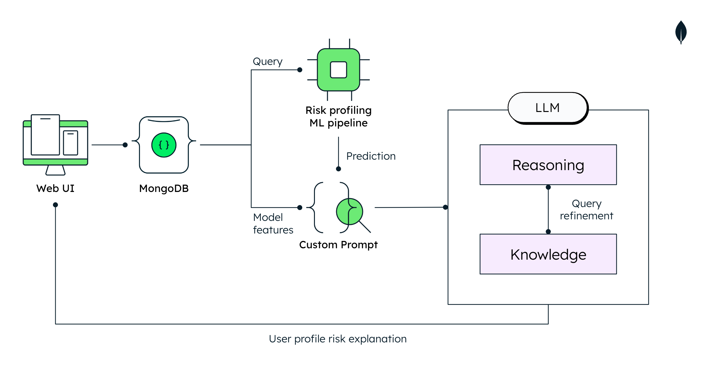
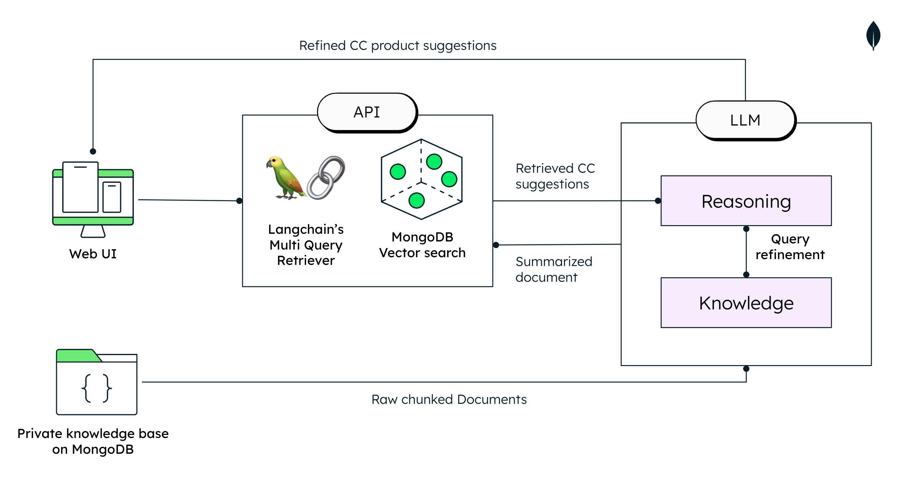

# Installation of the backend

These are some simple APIs built on Python.

## Getting Started

This project uses [uv](https://github.com/astral-sh/uv) as the package manager for faster dependency resolution and installation.

### Install UV

First, install `uv` if you haven't already:

```bash
curl -LsSf https://astral.sh/uv/install.sh | sh
```

Or use the makefile command:

```bash
make install_uv
```

### Setup Virtual Environment and Install Dependencies

Navigate to the backend directory and set up the environment:

```bash
cd backend
uv venv
uv sync
```

Or use the makefile commands:

```bash
make uv_init    # Create virtual environment
make uv_sync    # Install dependencies
```

### Environment Configuration

Next, please make sure to add a `.env` file in the folder `<location_of_your_repo>/Credit_score/backend`. 

**⚠️ IMPORTANT:** Never commit your `.env` file to version control! It contains sensitive credentials.

Create your `.env` file with the following variables:

```bash
# MongoDB Atlas Connection String
# Get your connection string from: https://cloud.mongodb.com/
MONGO_CONNECTION_STRING=

# MongoDB Database Name
MONGODB_DB=

# MongoDB Collection Name (for vector search)
MONGODB_COLLECTION=

# Fireworks AI API Key
# Sign up for free at: https://fireworks.ai/login
FIREWORKS_API_KEY=

# Voyage AI API Key (for embeddings)
# Get your API key from: https://www.voyageai.com/
VOYAGE_API_KEY=
```

> [!Warning]
> Replace all placeholder values with your actual credentials. The `.env` file is gitignored and will not be committed to the repository.

### Running the Backend

Run the backend services using `uv`:

```bash
cd backend
uv run uvicorn main:app --host 0.0.0.0 --port 8080 --reload
```

Or use the makefile command:

```bash
make uv_run
```

> [!Note]
> - All MongoDB operations are handled by the backend, the frontend does not connect directly to MongoDB
> - The frontend communicates with backend via Next.js proxy routes (no CORS issues)

### API Endpoints

**Credit Scoring:**
- `GET /credit_score/{user_id}` - Get credit score explanation and calculations
- `POST /product_suggestions` - Get product recommendations based on user profile

**User Data (for frontend):**
- `POST /user_data/find_one` - Find a user document (used by frontend)
- `POST /user_data/update_one` - Update a user document (used by frontend)

**Health Check:**
- `GET /` - Server status check

As a reminder, in this demo we use both AI as well as genAI. Below you can see the architecture of the first API. Simply put, we generate a custom prompt by enriching the existing information on the MongoDB database with the ML algorithm that we trained prior. This is then sent to the LLM to generate the explanation for the approval/rejection of the user's application.


The second API is slightly more complicated. Indeed, the user's profile from the previous API is sent into the second. Then a [MultiQueryRetriever](https://python.langchain.com/docs/modules/data_connection/retrievers/MultiQueryRetriever/) function allows us to effectively retrieve relevant information from our chunked credit card information database, before getting formatted and refined by the LLM.


Once you have done everything, we can move on to the next part:

- [Installation of the frontend](../frontend/)
- Or go back [to the main page](../)
