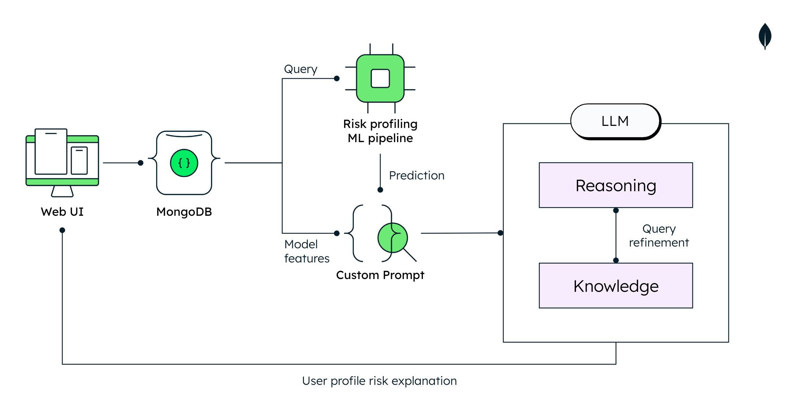
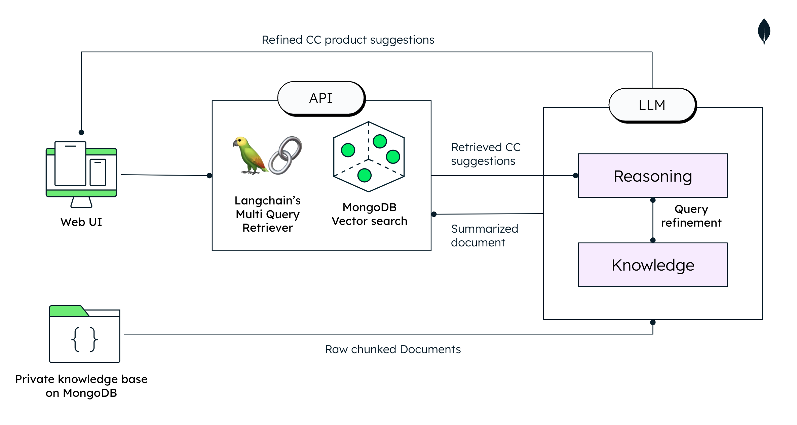

# Installation of the backend

These are some simple APIs built on Python.

## Getting Started

First, make sure that you have all of the requirements installed in your Python instance:

```bash
pip install -r requirements.txt
# or
pip3 install -r requirements.txt
```
Next, please make sure to add a .env file in the folder <location_of_your_repo>/Credit_score/backend. It should include the following:

```md
MONGO_CONNECTION_STRING=<Your_connection_string>
OPENAI_API_KEY=<Your_OpenAI_api_key>
GOOGLE_API_KEY=<Your_OpenAI_api_key>
MONGODB_DB=bfsi-genai 
```
> [!Warning]
> You only need to populate one of the API keys depending on which one you chose. As a reminder you can also decide to use OpenAI  but will require some light code changes. You will also need to use the file OpenAI.py instead of app.py. 

Lastly, run the bankend services:

```bash
python app.py
# or
python3 app.py
# or if you are running it on a server
pm2 start app.py --interpreter=python3
```
> [!Note]
> If you want to deploy this on a server, then you will need to install pm2, on top of the requirements. You will also need to call the APIs with the server's API which will need to be updated on the <location_of_your_repo>/Credit_score/frontend/.env file.

You should have two APIs:
- http://localhost:5000/credit_score?userId=<id_of_the_user_you_want_recomendation_for>
- http://localhost:5000/product_suggestions

As a reminder, in this demo we use Both AI as well as genAI. Below you can see the Architecture of the first API. Simply put, we generate a custom prompt by enriching the existing information on the MongoDB database with the ML algorithm that we trained prior. This is then sent to the LLM to generate the explanation for the approval/rejection of the User's application.


The second API is slightly more complicated. Indeed, the Users profile from the previous API is sent into the second. Then a [multi query retriever](https://python.langchain.com/docs/modules/data_connection/retrievers/MultiQueryRetriever/) function allows us to effectively retrieve relevant information from our chunked credit card information database, before getting formatted and refined by the LLM.


Once you have done everything, we can move on to the next part:
- [Installation of the frontend](../frontend/)
- Or go back [to the main page](../)